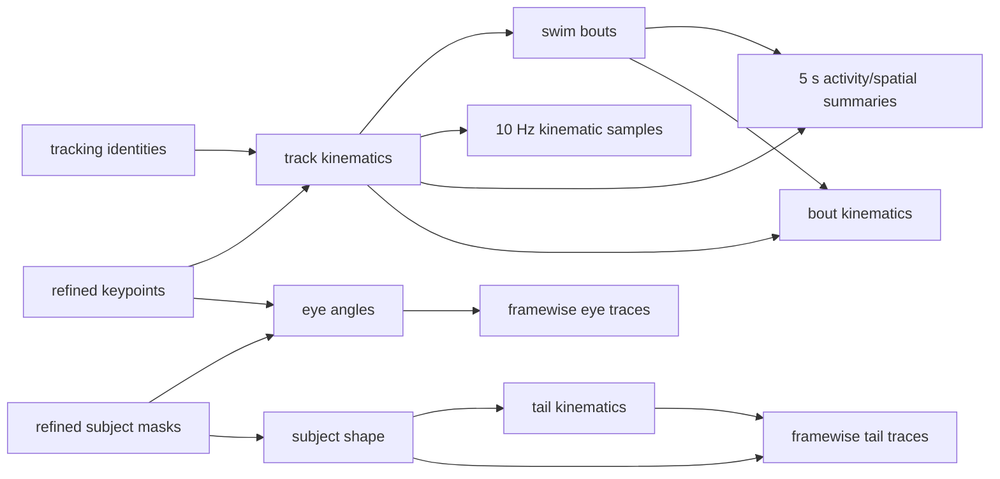

# Configurable analysis workflow DAGs

## Decision

Palette analysis workflows are declared as versioned directed acyclic graphs
(DAGs). A workflow says which persisted authorities it needs, which derived
analyses depend on them, and which immutable export products should be
materialized. Planning is separate from execution: the planner may inspect
`zarr.json` metadata and produce an execution order, but it does not open array
payloads, mutate the recording, submit jobs, or write a new analysis run.

The first packaged profile is
`src/fisheye/analysis_workflows/profiles/core_behavior_v1.yaml`. It is
stimulus-independent and can therefore be used for Sleepyfish as well as
chaser recordings. Stimulus-specific profiles can extend the same contract
with nodes such as chaser geometry, gratings, looming, or event-aligned
responses.

## Temporal-resolution policy

The core profile has these defaults:

| Product | Default | Configurable? | Source authority |
|---|---:|---|---|
| portable kinematic samples | 10 Hz | yes, positive finite rate | framewise Zarr kinematics |
| activity/spatial summaries | 5-second bins | yes, positive finite width | framewise Zarr kinematics and bouts |
| eye angles and convergence | framewise | no downsampling in this contract | framewise eye-angle analysis |
| tail splines, angles, and curvature | framewise | no downsampling in this contract | framewise subject shape and tail kinematics |

The sampled and binned products are portable analysis views. They do not
replace the framewise Zarr authorities. Eye and tail traces remain framewise
because their temporal structure is itself an analysis input; a consumer may
derive a lower-resolution view later without changing the export contract.

The profile owns the defaults. A particular plan can override the two numeric
values without editing the profile:

```bash
scripts/plan_analysis_workflow /path/to/recording_analysis.zarr \
  --kinematics-sample-rate-hz 20 \
  --activity-spatial-bin-size-s 2.5
```

Invalid rates, widths, and non-framewise eye or tail declarations are rejected
while loading the workflow.

The current cross-recording analytics exporter already has equivalent
`--baseline-sample-rate-hz` and `--baseline-time-bin-s` switches. An execution
adapter should pass the DAG's numeric policy to those exporter arguments when
materializing baseline products. The DAG planner does not silently invoke that
exporter.

## Node and dependency model

There are three node kinds:

- `prerequisite`: an input authority that this workflow must reuse, such as
  curated keypoints or dense refined subject masks;
- `analysis`: a canonical analysis stage from
  `fisheye.registry.stage_catalog`;
- `export`: an immutable table or trace product derived from analysis nodes.

The workflow references canonical stage IDs rather than inventing a second
stage vocabulary. Profile validation checks node IDs, targets, catalog
dependencies represented inside the profile, and dependency cycles.



Targets select a dependency closure. For example, planning only
`kinematics_samples` does not inspect or schedule the eye and tail branches.
When more than one target shares a dependency, that dependency appears once in
the stable topological order.

## Read-only planning

Run the packaged core profile with:

```bash
scripts/plan_analysis_workflow /path/to/recording_analysis.zarr
```

The planner reports one of three actions for every selected node:

- `reuse`: a selected persisted run is available;
- `run`: the stage or export product still needs materialization;
- `blocked`: a required authority is absent or the node is deliberately not
  safe to execute under its declared policy.

Availability inspection reads only the run-parent, selected-run, and declared
embedded-artifact `zarr.json` files. It prefers `latest_complete`, then
`latest_materialized`, then `latest`. A parent without a pointer is not
resolved by directory or lexicographic guessing; select the run explicitly:

```bash
scripts/plan_analysis_workflow /path/to/recording_analysis.zarr \
  --stage-run track_kinematics=my_calibrated_track_run
```

Useful planning controls include:

```bash
# Plan one product and only its dependencies.
scripts/plan_analysis_workflow /path/to/recording_analysis.zarr \
  --target eye_traces

# Emit a machine-readable plan. Writing this file does not modify the Zarr.
scripts/plan_analysis_workflow /path/to/recording_analysis.zarr \
  --json-output /tmp/recording.analysis-plan.json

# Model registry-provided availability without inspecting a local run.
scripts/plan_analysis_workflow /path/to/recording_analysis.zarr \
  --available-stage eye_angles=analysis/eye_angle_runs/eye_registry_run
```

For the current Sleepyfish canary, pinning its calibrated track run allows the
planner to reuse keypoints, refined subject masks, and track kinematics. It
then schedules swim bouts, bout kinematics, eye angles, and subject shape.

## Fail-closed execution

The executor supports these canonical analysis stages in the core profile:

- `track_kinematics`;
- `swim_bouts`;
- `track_kinematics_visualization`;
- `bout_kinematics`;
- `eye_angles`;
- `subject_shape`.

Track identities are a required persisted prerequisite rather than an
analysis-workflow output. Planning a new track-kinematics run therefore blocks
when no `tracking_runs` authority is present. Create lineage-matched tracking
from arena assignment first; an already complete track-kinematics run remains
reusable without rerunning that prerequisite.

The track-kinematics visualization stage writes the bounded PNG snapshot and
interactive explorer contract inside its selected track-kinematics run. It
inherits that run identity instead of inventing a separate visualization run,
and records the exact swim-bout input. A `bout_kinematics` target includes this
stage automatically, so a successful core workflow is immediately discoverable
by the recording explorer. Planning reuses the artifact only when both its
track-kinematics and swim-bout lineage match the selected dependency runs.

Execution requires one or more explicit analysis targets. The default remains
a read-only command render:

```bash
scripts/execute_analysis_workflow /path/to/recording_analysis.zarr \
  --target bout_kinematics \
  --target eye_angles \
  --target subject_shape \
  --stage-run track_kinematics=my_calibrated_track_run \
  --execution-id recording_core_canary_01 \
  --num-workers 8
```

The executor generates a safe output name for every independent analysis node
that must run, such as `swim_bouts_recording_core_canary_01`. Use
`--output-run STAGE=RUN` to override a generated name. It refuses existing
output metadata rather than overwriting it. Embedded visualization stages
inherit their authority run and reject independent `--output-run` names. Every
downstream command receives the exact reused or newly generated dependency run name. Use
`--force-stage STAGE` when a completed stage should intentionally be recomputed
as a new immutable run.

`--apply` is rejected unless `LSB_JOBID` is present. Do not invoke it on a
login node. Render a cluster job first:

```bash
scripts/submit_analysis_workflow_bsub.sh \
  --zarr /groups/path/to/recording_analysis.zarr \
  --execution-id recording_core_canary_01 \
  --target bout_kinematics \
  --target eye_angles \
  --target subject_shape \
  --stage-run track_kinematics=my_calibrated_track_run
```

Render-only mode reserves its immutable execution directory. After inspection,
submit the printed `bsub_command` through the poller, or use a fresh execution
ID with `--submit` to render and submit in one operation. The wrapper requires
a clean cluster-visible Palette checkout and captures its exact commit. The job
checks the commit and cleanliness again on the execution host. It runs nodes
serially in topological order, verifies the exact output run's completion
metadata after each command, and never starts a dependent node after an error.
Its atomic JSON report records commands, reused runs, generated outputs,
timestamps, return codes, and completion verification.

## Million-frame execution boundary

The executor preserves these large-recording constraints:

- track smoothing and derivatives have temporal boundary state and are still
  computed as complete ordered tracks. The track materializer opens the
  authoritative recording read-only, writes the regular completed run to
  node-local scratch, then assigns complete non-overlapping 262,144-row outer
  shards to copy workers. It validates the sharded run before copying it to a
  hidden shared-filesystem sibling, atomically renaming it, and updating the
  nested offline pointers under a per-recording lock;
- eye angles preserve non-overlapping physical Zarr chunk ownership;
- subject shape reads refined masks from the authoritative Zarr without
  mutation, computes into node-local 1,024-row logical blocks, assembles
  131,072-row indexed outer shards while preserving 256-row inner chunks,
  validates every decoded shard, and publishes the completed run group under a
  per-recording lock and atomic rename;
- Palette-native tail kinematics uses its dedicated staged materializer: it
  transfers only the required subject-shape arrays to node-local scratch,
  assigns complete non-overlapping 262,144-row output shards to process
  workers, computes each shard in bounded 16,384-row sub-blocks, validates
  locally, and publishes one completed run atomically. The core profile can
  therefore execute the `tail_kinematics` node with `--num-workers`;
- framewise eye and tail exports must stream row groups or array chunks. They
  must not accumulate the complete recording as one in-memory table.

Subject-shape, tail-kinematics, and track-kinematics publication share
`analysis_workflows.materializers.atomic_run_publisher`. Scientific validation,
completion, and pointer rules remain family-specific callbacks, while the
publisher owns the transaction: advisory locking, hidden same-parent copy,
physical inventory verification (with optional full content checksums), atomic
rename, pre-pointer and final validation, snapshots of every affected parent,
and rollback of both the new run and parent attrs after any post-rename error.
The per-family lock filenames and publish schema IDs remain stable. Published
runs record the shared publisher schema/version and the parent snapshots in
`cluster_output_staging`, so a future materializer does not need to create a
fourth transaction implementation.

For a subject-shape-only cluster run, render and then submit the DAG target. A
32-core node matches the measured canary configuration; request enough memory
for the observed 36.7 GB peak:

```bash
scripts/submit_analysis_workflow_bsub.sh \
  --zarr /groups/path/to/recording_analysis.zarr \
  --execution-id subject_shape_production_YYYYMMDD_01 \
  --target subject_shape \
  --ncores 32 \
  --mem-gb 2 \
  --walltime 24:00
```

Here `--mem-gb` is per slot, so 32 slots at 2 GB request 64 GB nominally for
the job, above the measured 36.7 GB peak. The site's `serial` application may
apply a higher per-slot floor; inspect the effective `bjobs -l` reservation.
The generated job pins all requested CPU slots to one host, sets the native
BLAS/OpenMP thread ceilings before Python starts, and therefore keeps every
process on the same node-local scratch. The materializer is dry-run by default
when invoked directly; the DAG adds `--apply` only inside the verified LSF
allocation.

The 10 Hz kinematic samples, 5-second activity/spatial summaries, and framewise
trace exports remain planning-only nodes. The executor rejects them instead of
pretending an adapter exists. Tail kinematics is executable after its staged,
chunk-safe materializer and million-frame canary validation.
Registry updates remain serialized after successful artifact publication.

## Adding another workflow

Create another versioned YAML profile using the same schema ID and canonical
stage catalog. A stimulus-specific profile should normally reuse the core
nodes and add only the required stimulus and response branches. New stage
families belong in `fisheye.registry.stage_catalog` first; the workflow format
is an orchestration view, not a second registry.

Every profile should define:

1. explicit default targets;
2. prerequisite authorities that cannot be synthesized automatically;
3. canonical stage dependencies and execution policies;
4. temporal product policies;
5. safe run-selection behavior;
6. deterministic tests for reuse, scheduling, blocking, and cycles.
