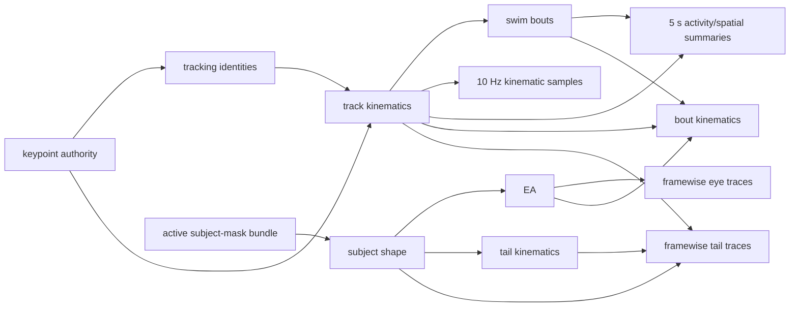

# Configurable analysis workflow DAGs

## Decision

Palette analysis workflows are declared as versioned directed acyclic graphs
(DAGs). A workflow says which persisted authorities it needs, which derived
analyses depend on them, and which immutable export products should be
materialized. Planning is separate from execution: the planner may inspect
`zarr.json` metadata and produce an execution order, but it does not open array
payloads, mutate the recording, submit jobs, or write a new analysis run.

The first packaged profile is
`src/fisheye/analysis_workflows/profiles/core_behavior_v1.yaml`. It is
stimulus-independent and can therefore be used for Sleepyfish as well as
chaser recordings. Stimulus-specific profiles can extend the same contract
with nodes such as chaser geometry, gratings, looming, or event-aligned
responses.

## Temporal-resolution policy

The core profile has these defaults:

| Product | Default | Configurable? | Source authority |
|---|---:|---|---|
| portable kinematic samples | 10 Hz | yes, positive finite rate | framewise Zarr kinematics |
| activity/spatial summaries | 5-second bins | yes, positive finite width | framewise Zarr kinematics and bouts; no arena-normalized occupancy without a geometry authority |
| eye angles and convergence | framewise | no downsampling in this contract | framewise eye-angle analysis |
| tail splines, angles, and curvature | framewise | no downsampling in this contract | framewise subject shape and tail kinematics |

The sampled and binned products are portable analysis views. They do not
replace the framewise Zarr authorities. Eye and tail traces remain framewise
because their temporal structure is itself an analysis input; a consumer may
derive a lower-resolution view later without changing the export contract.

The profile owns the defaults. A particular plan can override the two numeric
values without editing the profile:

```bash
scripts/plan_analysis_workflow /path/to/recording_analysis.zarr \
  --kinematics-sample-rate-hz 20 \
  --activity-spatial-bin-size-s 2.5
```

Invalid rates, widths, and non-framewise eye or tail declarations are rejected
while loading the workflow.

The current cross-recording analytics exporter already has equivalent
`--baseline-sample-rate-hz` and `--baseline-time-bin-s` switches. An execution
adapter should pass the DAG's numeric policy to those exporter arguments when
materializing baseline products. The DAG planner does not silently invoke that
exporter.

## Node and dependency model

There are four node kinds:

- `prerequisite`: an input authority that this workflow must reuse, such as
  the selected keypoint authority or active recording subject-mask bundle;
- `analysis`: a canonical analysis stage from
  `fisheye.registry.stage_catalog`;
- `visualization`: a bounded persisted renderer attached to an exact analysis
  run and its declared source dependencies;
- `export`: an immutable table or trace product derived from analysis nodes.

The workflow references canonical stage IDs rather than inventing a second
stage vocabulary. Profile validation checks node IDs, targets, catalog
dependencies represented inside the profile, and dependency cycles.



Targets select a dependency closure. For example, planning only
`kinematics_samples` does not inspect or schedule the eye and tail branches.
When more than one target shares a dependency, that dependency appears once in
the stable topological order. A reused downstream authority closes its branch:
missing ancestors of that already-complete authority remain visible in the
structural plan but are not recreated during execution.

## Read-only planning

Run the packaged core profile with:

```bash
scripts/plan_analysis_workflow /path/to/recording_analysis.zarr
```

The planner reports one of three actions for every selected node:

- `reuse`: a selected persisted run is available;
- `run`: the stage or export product still needs materialization;
- `blocked`: a required authority is absent or the node is deliberately not
  safe to execute under its declared policy.

Availability inspection reads only the run-parent, selected-run, and declared
embedded-artifact `zarr.json` files. It prefers `latest_complete`, then
`latest_materialized`, then `latest`. A parent without a pointer is not
resolved by directory or lexicographic guessing; select the run explicitly:

```bash
scripts/plan_analysis_workflow /path/to/recording_analysis.zarr \
  --stage-run track_kinematics=my_calibrated_track_run
```

The core profile's keypoint prerequisite is an authority role, not a hardcoded
storage family. Planning first accepts the refined member of an active
keypoint bundle, then a maintained refined selector, and finally a
selector-eligible `keypoints_runs/<run>` canonical passthrough. The last form
is how clipped inference avoids manufacturing a no-op refined-keypoint copy.
Any present-but-malformed root authority or activation lease blocks planning.

Subject masks resolve through `subject_mask_authority` at the archive root.
The planner verifies the active bundle and refined member readiness metadata,
then passes `bundle/<bundle_id>` to subject shape. It does not reinterpret the
bundle member's intentionally false legacy stage selector as an error or set a
parallel `refined_subject_masks_runs.latest` pointer.

Useful planning controls include:

```bash
# Plan one product and only its dependencies.
scripts/plan_analysis_workflow /path/to/recording_analysis.zarr \
  --target eye_traces

# Emit a machine-readable plan. Writing this file does not modify the Zarr.
scripts/plan_analysis_workflow /path/to/recording_analysis.zarr \
  --json-output /tmp/recording.analysis-plan.json

# Model registry-provided availability without inspecting a local run.
scripts/plan_analysis_workflow /path/to/recording_analysis.zarr \
  --available-stage eye_angles=analysis/eye_angle_runs/eye_registry_run
```

For a completed Sleepyfish archive, pinning its calibrated track run allows the
planner to reuse keypoint, mask, and motion authorities before scheduling the
remaining products. A newly processed clipped archive can instead resolve its
canonical keypoints and active mask bundle and schedule tracking plus the same
downstream nodes in one plan.

## Fail-closed execution

The executor supports these canonical analysis stages in the core profile:

- `tracks` (exact keypoint-source crop rowset, single subject per arena);
- `track_kinematics`;
- `swim_bouts`;
- `track_kinematics_visualization`;
- `bout_kinematics`;
- `eye_angles`;
- `subject_shape`;
- `tail_kinematics`.

It also supports the opt-in `eye_traces`, `kinematics_samples`,
`activity_spatial_summaries`, and `tail_traces` export nodes. These are not Zarr
analysis stages: each projects explicit completed recording-local authorities
into one immutable manifest-selected Parquet generation.
`activity_spatial_summaries` binds the track-motion run plus an exact swim-bout
run. Because the packaged DAG carries one swim-bout dependency, execution
proves the track source contains exactly one track; multi-track publication
requires the CLI's explicit per-track run map. `tail_traces` binds its explicit
tail-kinematics, subject-shape, and track-motion dependencies, joins every tail
observation to exactly one `track_id` through unique `instance_key` plus camera
frame, and emits bounded long-form body-normalized parts. `instance_key`
remains an observation identity, never an animal or track identifier.

Track identities are composable in the same workflow. When no selected
`tracking_runs` authority exists, the `tracks` node resolves the exact source
crop declared by the selected keypoint authority, runs spatial arena assignment
for the recording's experiment setup, and publishes exact-named
`single_subject_per_arena` tracking. Canonical clipped keypoints and original
refined keypoints therefore use the same tracking writer and downstream motion
infrastructure. An already complete track-kinematics run remains reusable
without recreating its tracking ancestors.

The track-kinematics visualization stage writes the bounded PNG snapshot and
interactive explorer contract inside its selected track-kinematics run. It
inherits that run identity instead of inventing a separate visualization run,
and records the exact swim-bout input. A `bout_kinematics` target includes this
stage automatically, so a successful core workflow is immediately discoverable
by the recording explorer. Planning reuses the artifact only when both its
track-kinematics and swim-bout lineage match the selected dependency runs.
Bout kinematics also depends on the exact eye-angle node: eye-gaze summaries
are part of the default contract, and the rendered command pins that completed
run rather than resolving a mutable `latest` pointer at execution time.

Execution requires one or more explicit analysis or implemented export
targets. The default remains a read-only command render:

```bash
scripts/execute_analysis_workflow /path/to/recording_analysis.zarr \
  --target bout_kinematics \
  --target eye_angles \
  --target subject_shape \
  --stage-run track_kinematics=my_calibrated_track_run \
  --execution-id recording_core_canary_01 \
  --num-workers 8
```

The executor generates a safe output name for every independent analysis node
that must run, such as `swim_bouts_recording_core_canary_01`. Use
`--output-run STAGE=RUN` to override a generated name. It refuses existing
output metadata rather than overwriting it. Embedded visualization stages
inherit their authority run and reject independent `--output-run` names. Every
downstream command receives the exact reused or newly generated dependency run name. Use
`--force-stage STAGE` when a completed stage should intentionally be recomputed
as a new immutable run.

Every implemented export additionally requires an immutable publication root
and an explicit node-local scratch root when the executor is invoked directly.
For example:

```bash
scripts/execute_analysis_workflow /path/to/recording_analysis.zarr \
  --target eye_traces \
  --stage-run eye_angles=eye_compact_v7 \
  --export-run eye_traces=eye_trace_query_v1 \
  --export-root /shared/query-products \
  --scratch-root /node-local/palette-eye-export \
  --execution-id eye_trace_canary_01
```

The execution receipt distinguishes `parquet_export` outputs from
`zarr_stage` outputs. Successful exports are reopened through their exclusive
manifest and fully validated; they are never passed to Zarr-stage discovery or
projected into the derived-stage registry.

The activity/spatial equivalent pins both source runs and the configured bin
width from the workflow profile:

```bash
scripts/execute_analysis_workflow /path/to/recording_analysis.zarr \
  --target activity_spatial_summaries \
  --stage-run track_kinematics=physical_track_run \
  --stage-run swim_bouts=bouts_for_the_only_track \
  --export-run activity_spatial_summaries=activity_query_v1 \
  --export-root /shared/query-products \
  --scratch-root /node-local/palette-activity-export \
  --execution-id activity_canary_01
```

`--apply` is rejected unless `LSB_JOBID` is present. Do not invoke it on a
login node. Render a cluster job first:

```bash
scripts/submit_analysis_workflow_bsub.sh \
  --zarr /groups/path/to/recording_analysis.zarr \
  --execution-id recording_core_canary_01 \
  --target bout_kinematics \
  --target eye_angles \
  --target subject_shape \
  --stage-run track_kinematics=my_calibrated_track_run
```

For every opt-in export, the LSF wrapper derives a per-execution scratch root
below the worker's `${TMPDIR}` unless `--scratch-root` explicitly supplies a
different node-local path. For example:

```bash
scripts/submit_analysis_workflow_bsub.sh \
  --zarr /groups/path/to/recording_analysis.zarr \
  --execution-id eye_trace_canary_01 \
  --target eye_traces \
  --stage-run eye_angles=eye_compact_v7 \
  --export-run eye_traces=eye_trace_query_v1 \
  --export-root /groups/path/to/immutable-query-products
```

The effective scratch path and its explicit/default origin are recorded in the
runtime and status sidecars. The publisher deletes its generation-specific
scratch child after success or failure; the immutable Parquet generation and
manifest remain under `--export-root`.

Render-only mode reserves its immutable execution directory. After inspection,
submit the printed `bsub_command` through the poller, or use a fresh execution
ID with `--submit` to render and submit in one operation. The wrapper requires
a clean cluster-visible Palette checkout and captures its exact commit. The job
checks the commit and cleanliness again on the execution host. It runs nodes
serially in topological order, verifies the exact output run's completion
metadata after each command, and never starts a dependent node after an error.
Its atomic JSON report records commands, reused runs, generated outputs,
timestamps, return codes, and completion verification.

The submission directory also separates requested resources from the allocation
that actually ran. `submission.txt` records the requested queue, core count,
memory per slot, and walltime. At job start, `runtime_environment.txt` records
the effective LSF queue, execution host and host list, allocated slots, CPU
model and architecture, logical CPU count, and kernel release. `status.txt`
repeats the requested/effective queue, host, CPU model, and allocation size so
benchmark comparisons can reject runs made on incompatible worker classes.
Successful finalized analysis runs also persist the effective scheduler
allocation under `run_provenance.scheduler` and lightweight host, CPU, and
kernel identity under `run_provenance.runtime`. The sidecars remain necessary
for requested-resource provenance and for jobs that fail before publishing an
immutable run.

## Million-frame execution boundary

The executor preserves these large-recording constraints:

- track smoothing and derivatives have temporal boundary state and are still
  computed as complete ordered tracks. The track materializer opens the
  authoritative recording read-only, writes the regular completed run to
  node-local scratch, then assigns complete non-overlapping 262,144-row outer
  shards to copy workers. It validates the sharded run before copying it to a
  hidden shared-filesystem sibling, atomically renaming it, and updating the
  nested offline pointers under a per-recording lock;
- swim-bout detection preserves its signal-major compact-v2 logical contract.
  Its small dense detector payload uses one regular recording-length chunk
  because the trace is normally consumed whole and the Sleepyfish benchmark
  found indexed inner-chunk overhead dominated both full and bounded reads.
  This is a detector-product policy, not a general framewise-array policy.
  Sparse event and bout tables continue to use the adaptive shared columnar
  writer: one-chunk tables remain regular and larger multi-chunk tables acquire
  aligned row shards;
- eye angles use their dedicated production materializer. It resolves completed
  subject-shape eye ellipses and refined keypoints, transfers only those exact
  arrays to node-local scratch, records the authoritative and staged locations
  separately, and runs framewise computation against the staged archive.
  Completed regular output is converted to indexed shards with exact decoded
  validation before checksum-verified atomic publication. Compact
  `roi_angles` and `frame_angles` use semantic name-local column order,
  approximately `(4096, 16)` inner chunks, and `(131072, 32)` outer shards;
  their requested and effective grids are persisted in materialization
  provenance;
- subject shape reads refined masks from the authoritative Zarr without
  mutation, computes into node-local 1,024-row logical blocks, assembles
  131,072-row indexed outer shards while preserving 256-row inner chunks,
  validates every decoded shard, and publishes the completed run group under a
  per-recording lock and atomic rename;
- Palette-native tail kinematics uses its dedicated staged materializer: it
  transfers only the required subject-shape arrays to node-local scratch,
  assigns complete non-overlapping 262,144-row output shards to process
  workers, computes each shard in bounded 16,384-row sub-blocks, validates
  locally, and publishes one completed run atomically. The core profile can
  therefore execute the `tail_kinematics` node with `--num-workers`;
- framewise eye and tail exports must stream row groups or array chunks. They
  must not accumulate the complete recording as one in-memory table.

Subject-shape, tail-kinematics, track-kinematics, eye-angle, bout-kinematics,
swim-bout, and stimulus-response production publication share
`analysis_workflows.materializers.atomic_run_publisher`. Scientific validation,
completion, and pointer rules remain family-specific callbacks, while the
publisher owns the transaction: advisory locking, hidden same-parent copy,
physical inventory verification (with optional full content checksums), atomic
rename, pre-pointer and final validation, snapshots of every affected parent,
and rollback of both the new run and parent attrs after any post-rename error.
The per-family lock filenames and publish schema IDs remain stable. Lower-level
writers may still target in-memory or disposable Zarr groups for tests, but
operator CLIs and DAG execution publish authoritative runs through the shared
transaction. Published runs record the shared publisher schema/version and the parent snapshots in
`cluster_output_staging`, so each new materializer can reuse the same
transaction implementation.

Eye-angle provenance is intentionally layered. `eye_angle_source_contracts`
names the exact subject-shape, refined-keypoint, base-keypoint, and physical
array paths; `eye_angle_algorithm_contract` records ellipse normalization,
body-frame construction, major-axis ambiguity resolution, angle definitions,
smoothing, frame projection, and derivatives; and
`node_local_materialization` records the physical input inventory, metadata and
logical-contract hashes, staged and authoritative paths, compute arguments,
thread/worker settings, sharding report, and validations. Publication adds a
second source-revision audit and the transaction record in
`cluster_output_staging`. Full source-array content is not re-hashed: the
record states that assurance relies on completed immutable input runs plus
path/size/mtime inventory and selected-metadata SHA-256.

Swim-bout provenance follows the same scientific-contract principle. The
run-level `swim_bout_algorithm_contract` and identical provenance member use
schema `analysis.swim_bout_algorithm_contract` version 1. They name the source
speed and frame axes, causal exponential recurrence and reset behavior, active
detection primitive and parameters, gap/overlap and boundary rules, interval
semantics, validity handling, and physical metric sources. A persisted SHA-256
binds the two copies.

Compact swim-bout run schema 8 also stores
`palette.swim_bout_frame_axis_reference` version 1. It pins the exact
archive-relative track-kinematics `frame_indices` path and records source run,
track, shape, dtype, and canonical value hash. The default is reference-only;
an embedded fallback is opt-in for standalone portability. Palette and
FileGlancer-hosted Marimo readers resolve the authority first and retain
schema-7 embedded compatibility.

For a subject-shape-only cluster run, render and then submit the DAG target. A
32-core node matches the measured canary configuration; request enough memory
for the observed 36.7 GB peak:

```bash
scripts/submit_analysis_workflow_bsub.sh \
  --zarr /groups/path/to/recording_analysis.zarr \
  --execution-id subject_shape_production_YYYYMMDD_01 \
  --target subject_shape \
  --ncores 32 \
  --mem-gb 2 \
  --walltime 24:00
```

Here `--mem-gb` is per slot, so 32 slots at 2 GB request 64 GB nominally for
the job, above the measured 36.7 GB peak. The site's `serial` application may
apply a higher per-slot floor; inspect the effective `bjobs -l` reservation.
The generated job pins all requested CPU slots to one host, sets the native
BLAS/OpenMP thread ceilings before Python starts, and therefore keeps every
process on the same node-local scratch. The materializer is dry-run by default
when invoked directly; the DAG adds `--apply` only inside the verified LSF
allocation.

The 10 Hz kinematic samples, 5-second activity/spatial summaries, framewise eye
traces, and long-form framewise tail traces now have exact opt-in publishers
and execution adapters. All remain immutable query projections rather than
recording-local scientific authorities, and none activates a selector or
registry authority.
Tail kinematics itself is executable after its staged, chunk-safe materializer
and million-frame canary validation.
Registry updates remain serialized after successful artifact publication.

## Adding another workflow

Create another versioned YAML profile using the same schema ID and canonical
stage catalog. A stimulus-specific profile should normally reuse the core
nodes and add only the required stimulus and response branches. New stage
families belong in `fisheye.registry.stage_catalog` first; the workflow format
is an orchestration view, not a second registry.

Every profile should define:

1. explicit default targets;
2. prerequisite authorities that cannot be synthesized automatically;
3. canonical stage dependencies and execution policies;
4. temporal product policies;
5. safe run-selection behavior;
6. deterministic tests for reuse, scheduling, blocking, and cycles.
