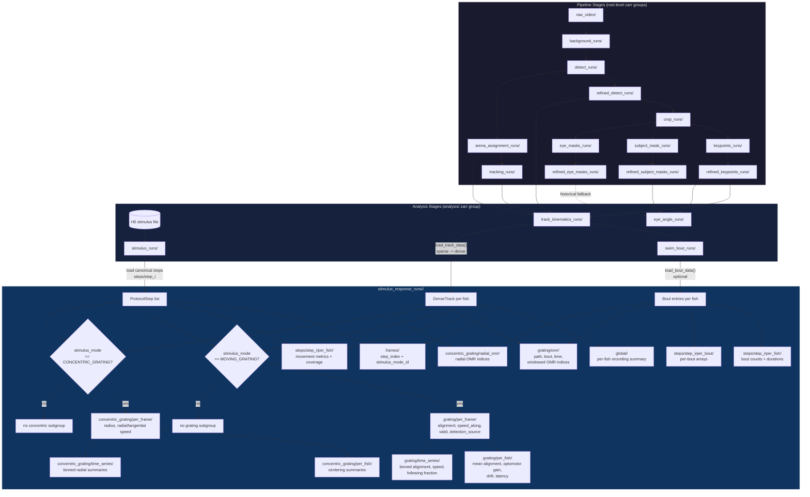

# Stimulus Response Analysis Flow

How data flows from raw video through the pipeline into biological metrics.

## Data Flow Diagram



## Inputs

stimulus_response consumes three upstream sources (one required, two optional):

| Source | Zarr Path | Required | What It Provides |
|--------|-----------|----------|------------------|
| Track kinematics | `analysis/track_kinematics_runs/<type>/<run>/` | Yes | Per-fish positions, headings, speeds, frame indices, detection source |
| Stimulus metadata | `analysis/stimulus_runs/<run>/` | Yes | Canonical step timing, stimulus mode, normalized step geometry, protocol JSON provenance |
| Swim bouts | `analysis/swim_bout_runs/<run>/` | No | Bout boundaries and speed per fish |

### Identity model

stimulus_response is a **pure consumer** of identity-resolved data.  It does
not perform identity resolution.  By the time data reaches track_kinematics,
`fish_id` is a settled per-arena identity assigned by `arena_assignment` and
`tracking` upstream.

### Sparse-to-dense expansion

Track kinematics stores **sparse** arrays (only detected frames).
stimulus_response expands to **dense** on load:

```python
speed = np.zeros(n_frames, dtype=np.float32)      # gaps are zero
valid = np.zeros(n_frames, dtype=bool)              # gaps are False
det_src = np.full(n_frames, -1, dtype=np.int8)      # gaps are -1
speed[frame_indices] = track_group["speed_smoothed_mm"][:]
valid[frame_indices] = True
det_src[frame_indices] = track_group["detection_source"][:]
```

This makes step slicing positional (`array[start:end]`) and gap semantics
explicit.  The upstream data is **not duplicated** into the stimulus_response
zarr output.

Implementation note, 2026-04-26:

- dense movement arrays may use zeros or sentinel values for missing frames, but
  distance summaries must not be recomputed by taking position differences
  across only valid frames
- `track_kinematics` is the source of truth for gap-aware displacement and
  cumulative distance semantics
- stimulus-response distance metrics should consume those displacement or
  cumulative-distance arrays, or reproduce the same consecutive-frame rule
- this avoids inventing movement across frame gaps when a sparse track has valid
  samples before and after a missing interval

## Outputs

### Recording-wide

| Group | Contents | Purpose |
|-------|----------|---------|
| `global/` | fish_id, total_distance_mm, mean_speed_mm_s, total_active_s, fraction_moving | Whole-recording per-fish summary |
| `frames/` | step_index[n_frames], stimulus_mode_id[n_frames] | Annotation layer: which stimulus was active at each frame |

`frames/` is **annotation, not duplication**.  To plot a continuous speed trace
color-coded by stimulus, read speed from track_kinematics and step_index from
`frames/`.

### Per-step

Each `steps/step_{i}/` group contains:

| Subgroup | When Present | Contents |
|----------|-------------|----------|
| `per_fish/` | Always | Movement metrics (distance, speed, fraction_moving, coverage) + optional bout metrics (num_bouts, mean_bout_duration_s, mean_interbout_interval_s) |
| `per_bout/` | When bout data available and bouts exist in step | Per-bout arrays (fish_id, bout_id, start/end frame, duration, speed) |
| `grating/` | Only for MOVING_GRATING steps | Heading alignment and optomotor metrics (see below) |
| `grating/omr/` | MOVING_GRATING steps when OMR is enabled | Stimulus-aligned path, bout, time, windowed, early-window, occupancy, and first directed-bout metrics |
| `concentric_grating/` | Only for CONCENTRIC_GRATING steps with a resolved center | Centering/polar decomposition metrics |
| `concentric_grating/radial_omr/` | CONCENTRIC_GRATING steps when OMR is enabled | Radial/tangential OMR metrics using authored or validated expanding/contracting polarity |

Step attributes record: `step_index`, `step_name`, `stimulus_mode`,
`stimulus_mode_id`, `start_frame`, `end_frame`, `duration_s`,
`stimulus_params`.

### Grating metrics (MOVING_GRATING steps only)

```
grating/
├── per_frame/
│   ├── valid                  bool[n_fish, n_step_frames]
│   ├── detection_source       int8[n_fish, n_step_frames]   # 0=real, 1=interpolated, -1=gap
│   ├── alignment_angle_deg    float32[n_fish, n_step_frames]
│   ├── alignment_cos          float32[n_fish, n_step_frames]
│   ├── speed_along_grating    float32[n_fish, n_step_frames]
│   └── angular_velocity       float32[n_fish, n_step_frames]
│
├── per_fish/
│   ├── mean_alignment_cos, resultant_vector_length
│   ├── fraction_following, fraction_opposing, fraction_perpendicular
│   ├── speed_weighted_alignment, optomotor_gain
│   ├── drift_along_grating_mm, drift_perp_grating_mm
│   └── latency_to_follow_s
│
└── time_series/
    ├── bin_center_s            float32[n_bins]
    ├── alignment_cos           float32[n_fish, n_bins]
    ├── speed_mm_s              float32[n_fish, n_bins]
    ├── fraction_following      float32[n_fish, n_bins]
    └── optomotor_gain          float32[n_fish, n_bins]
```

### Frame trustworthiness

Per-frame grating data carries two quality columns:

| `detection_source` | `valid` | Meaning |
|---|---|---|
| `0` | `True` | Real detection — heading measured from keypoints |
| `1` | `True` | Interpolated — heading was gap-filled, not directly observed |
| `-1` | `False` | No detection — gap frame, all metric values are zero |

Filter with `valid` for any detection, or `detection_source == 0` for only
directly observed frames.

### OMR detector-vs-estimator rule

`grating/omr/` and `concentric_grating/radial_omr/` treat swim-bout runs as
event-boundary detectors only. Physical OMR metrics are measured from
track-kinematics estimator surfaces such as `positions_mm`, gap-aware path
transitions, and `speed_smoothed_mm`. Local OMR attrs record the
`detector_estimator_policy`, source arrays, projection deadzones, window
lengths, and stimulus direction/polarity provenance so strict consumers can
interpret each metric without re-reading implementation code.

## Provenance

Each stimulus_response run records full lineage in `attrs["provenance"]`:

```
provenance.inputs:
  source_track_kinematics_run   ← which kinematics run
  source_stimulus_run           ← which stimulus run
  source_bout_run               ← which bout run (if used)
  archive:
    source_video_path           ← which video file
    session_uuid                ← unique recording identity
  upstream_lineage:
    detection_run               ← which detections
    keypoint_run                ← which keypoints
    crop_run                    ← which crops
    source_tracking_run         ← which tracking run
    source_arena_assignment_run ← which arena assignment
    fps, pixel_to_mm            ← calibration used
    kinematics_git_commit       ← code version that produced kinematics
```

One read gives the full chain from biological metric to source video.

## Usage

```bash
scripts/py -m fisheye.analysis.stimulus_response <zarr_path> \
    --track-kinematics-type offline \
    --moving-threshold-mm-s 2.0 \
    --camera-to-projector-offset-deg 0.0 \
    --bin-size-s 1.0
```

Optional flags: `--bout-run`, `--no-bouts`, `--follow-threshold`,
`--follow-window-s`, `--run-name`.

## Multi-stimulus recordings

A recording with protocol `[SOLID_BLACK, GRATING@90, SOLID_BLACK, GRATING@270]`
produces four step groups.  Each step has its own base movement metrics.
Grating steps additionally get `grating/` subgroups with direction-specific
alignment computed from each step's own `orientation_degrees` parameter.

The `frames/` annotation array lets you reconstruct the full timeline:

```python
step_idx = sr["frames"]["step_index"][:]    # which step at each frame
mode_id = sr["frames"]["stimulus_mode_id"][:] # which stimulus type

# Find all MOVING_GRATING frames across the recording
grating_mask = (mode_id == 3)
```

No stitching required — the annotation spans the whole recording.

## Related documents

- `docs/stimulus_response_run_design.md` — storage layout and metric definitions
- `docs/stimulus_response_implementation_plan.md` — design decisions and sequencing
- `docs/grating_analysis_acquisition_questions.md` — calibration blockers for angular accuracy
- `docs/analysis_dense_array_migration_todo.md` — future: dense arrays at track_kinematics source
- `src/fisheye/docs/zarr_structure.md` — authoritative zarr layout reference
